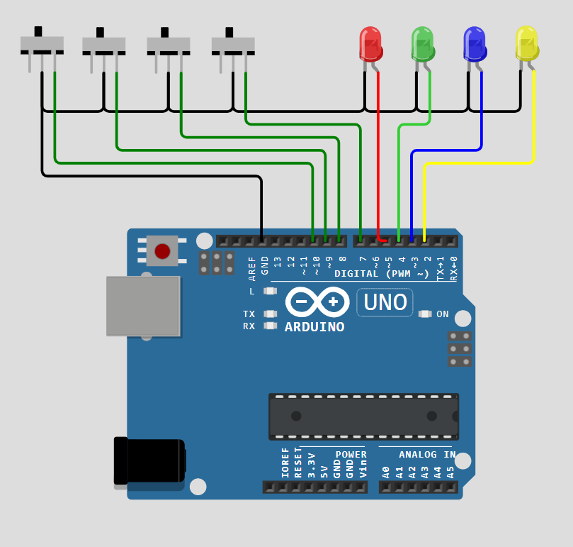

# Magic Switchboard

<p align="center">
    <a href="https://www.youtube.com/shorts/B3GOsys1LTc" target="_blank">
        
    </a>
</p>

Welcome to the Magic Switchboard project! This intriguing project demonstrates a creative approach to mapping switches to LEDs, where even after swapping caps or bulbs, each switch always lights up its respective color.

## Table of Contents

- [Magic Switchboard](#magic-switchboard)
  - [Table of Contents](#table-of-contents)
  - [📖 Introduction](#-introduction)
  - [🔧 Components](#-components)
  - [🔌 Circuit Diagram](#-circuit-diagram)
  - [🚀 Setup Instructions](#-setup-instructions)
    - [1. Clone the Repository](#1-clone-the-repository)
    - [2. Install Required Libraries](#2-install-required-libraries)
    - [3. Assemble the Circuit](#3-assemble-the-circuit)
    - [4. Upload the Code](#4-upload-the-code)
  - [💡 Code Explanation](#-code-explanation)
    - [Key Features of the Code:](#key-features-of-the-code)
    - [Example Code Snippet:](#example-code-snippet)
      - [Assigning LEDs Dynamically](#assigning-leds-dynamically)
      - [Updating LEDs Based on Assignments](#updating-leds-based-on-assignments)
  - [📜 Additional Documentation](#-additional-documentation)
  - [🖥️ Usage](#️-usage)
  - [🎉 Acknowledgments](#-acknowledgments)

## 📖 Introduction

The Magic Switchboard project showcases an interactive way to control LEDs using switches with logical mappings that remain consistent despite physical rearrangements. This project is perfect for demonstrating logical controls, mappings, and interactive play.

## 🔧 Components

- **Arduino Uno**
- **4 LEDs** (Red, Green, Yellow, Blue)
- **4 Push-button Switches**
- **Jumper Wires**
- **Breadboard**

## 🔌 Circuit Diagram

<p align="center">
    
</p>

## 🚀 Setup Instructions

### 1. Clone the Repository

```bash
git clone https://github.com/dibyasn/Arduino_Projects.git
cd Arduino_Projects/Magic_Switchboard
```

### 2. Install Required Libraries

No additional libraries are required for this project. The built-in Arduino functions handle all the necessary functionalities.

### 3. Assemble the Circuit

To assemble the circuit, follow these steps:

1. **Place the LEDs and Switches:**
   - Insert the 4 LEDs (Red, Green, Yellow, Blue) into the breadboard, ensuring they are spaced apart and their cathodes (short legs) are connected to the ground rail of the breadboard.
   - Place the 4 push-button switches on the breadboard.

2. **Connect the LED Cathodes to Ground:**
   - Use jumper wires to connect the cathodes of all LEDs to the GND pin of the Arduino via the breadboard’s ground rail.

3. **Connect LED Anodes to Arduino Pins:**
   - Connect the anodes (long legs) of the LEDs to Arduino pins 2, 3, 4, and 5 using jumper wires.

4. **Connect Switches to Arduino Pins:**
   - Attach one terminal of each switch to the ground rail on the breadboard.
   - Connect the other terminal of each switch to Arduino pins 7, 8, 9, and 10.

5. **Add Pull-up Resistors:**
   - The Arduino’s internal pull-up resistors will handle input stability, so no additional external resistors are required.

6. **Verify Connections:**
   - Double-check all connections against the circuit diagram to ensure proper assembly.


### 4. Upload the Code

1. Open the Arduino IDE.
2. Navigate to the `Code.ino` file in the `Code` folder.
3. Select the correct **Board** and **Port** from the Arduino IDE.
4. Upload the code to your Arduino Uno.

## 💡 Code Explanation

### Key Features of the Code:

- **Dynamic LED Assignment**: Each switch dynamically assigns itself to an LED slot upon activation.
- **Startup Behavior**: Ensures all switches and LEDs are initialized correctly before normal operation.
- **Real-time Updates**: Changes to switches and LEDs are reflected immediately.

### Example Code Snippet:

#### Assigning LEDs Dynamically

```cpp
void assignLED(int switchIndex) {
    for (int i = 0; i < 4; i++) {
        if (ledAssignment[i] == -1) {
            ledAssignment[i] = switchIndex;
            updateLEDs();
            return;
        }
    }
}
```

#### Updating LEDs Based on Assignments

```cpp
void updateLEDs() {
    for (int i = 0; i < 4; i++) {
        digitalWrite(ledPins[i], LOW);
    }

    for (int i = 0; i < 4; i++) {
        if (ledAssignment[i] != -1) {
            digitalWrite(ledPins[i], HIGH);
        }
    }
}
```

## 📜 Additional Documentation

- [Project Documentation](./Assets/Magic_Switchboard.pdf)
- [Source Code](./Assets/Code/Code.ino)
- [Working Explanation](https://www.youtube.com/watch?v=JOVQ8KCsOPs)

## 🖥️ Usage

1. Power on the Arduino Uno.
2. Press any switch to turn on the corresponding LED.
3. Swap LED caps or bulbs, and observe that each switch still lights up its respective color.
4. Experiment by rearranging switch and LED positions to see the logical mappings in action.

## 🎉 Acknowledgments

This project combines the fun of interactive play with the logic of dynamic mapping, making it a great educational tool. A special thanks to the open-source community for inspiring creativity in electronics and programming.

---

<p align="center">
    
</p>

---

Feel free to contribute, report issues, or suggest enhancements. Happy coding! 🚀

<p align="center">
    <a href="https://github.com/dibyasn"></a>
</p>

